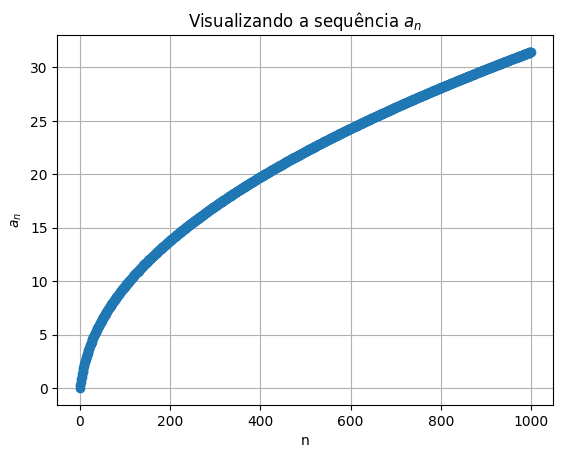

# SEQUENCIAS E SÉRIES

## CAPÍTULO 11 - JAMES STEWART - CÁLCULO VOLUME 2

### SEQUÊNCIAS


```python

```


```python
import matplotlib.pyplot as plt
import numpy as np
import plotly.graph_objects as go
```


```python
def an(n):
  return n/(n+1)

# Criando uma lista de números para esta sequencia

n = 500
an_seq = [an(i) for i in range(n)]

# Plotando os pontos

plt.plot(an_seq, 'o')
plt.xlabel('n')
plt.ylabel('$a_{n}$')
plt.title('Visualizando a sequência $a_{n}$')
plt.grid(True)
plt.show()
```


    

    


```python
# Exemplo de um sequência com fórmula de recorrência

# Gerando os primeiros 10 números de Fibonacci
def fibonacci(n):
    if n <= 0:
        return 0
    elif n == 1:
        return 1
    else:
        return fibonacci(n-1) + fibonacci(n-2)

# Criando a lista de números de Fibonacci
n = 30
fib_seq = [fibonacci(i) for i in range(n)]

# Plotando o gráfico
#plt.plot(fib_seq, 'o')
#plt.xlabel('Índice')
#plt.ylabel('Valor')
#plt.title('Sequência de Fibonacci')
#plt.show()

# Criando um gráfico de linha interativo
fig = go.Figure(data=go.Scatter(x=list(range(20)), y=fib_seq))
fig.update_layout(title='Sequência de Fibonacci')
fig.show()
```


<html>
<head><meta charset="utf-8" /></head>
<body>
    <div>            <script src="https://cdnjs.cloudflare.com/ajax/libs/mathjax/2.7.5/MathJax.js?config=TeX-AMS-MML_SVG"></script><script type="text/javascript">if (window.MathJax && window.MathJax.Hub && window.MathJax.Hub.Config) {window.MathJax.Hub.Config({SVG: {font: "STIX-Web"}});}</script>                <script type="text/javascript">window.PlotlyConfig = {MathJaxConfig: 'local'};</script>
        <script charset="utf-8" src="https://cdn.plot.ly/plotly-2.24.1.min.js"></script>                <div id="e50850b2-dd47-4858-8f88-4ffe04f4dec8" class="plotly-graph-div" style="height:525px; width:100%;"></div>            <script type="text/javascript">                                    window.PLOTLYENV=window.PLOTLYENV || {};                                    if (document.getElementById("e50850b2-dd47-4858-8f88-4ffe04f4dec8")) {                    Plotly.newPlot(                        "e50850b2-dd47-4858-8f88-4ffe04f4dec8",                        [{"x":[0,1,2,3,4,5,6,7,8,9,10,11,12,13,14,15,16,17,18,19],"y":[0,1,1,2,3,5,8,13,21,34,55,89,144,233,377,610,987,1597,2584,4181,6765,10946,17711,28657,46368,75025,121393,196418,317811,514229],"type":"scatter"}],                        {"template":{"data":{"histogram2dcontour":[{"type":"histogram2dcontour","colorbar":{"outlinewidth":0,"ticks":""},"colorscale":[[0.0,"#0d0887"],[0.1111111111111111,"#46039f"],[0.2222222222222222,"#7201a8"],[0.3333333333333333,"#9c179e"],[0.4444444444444444,"#bd3786"],[0.5555555555555556,"#d8576b"],[0.6666666666666666,"#ed7953"],[0.7777777777777778,"#fb9f3a"],[0.8888888888888888,"#fdca26"],[1.0,"#f0f921"]]}],"choropleth":[{"type":"choropleth","colorbar":{"outlinewidth":0,"ticks":""}}],"histogram2d":[{"type":"histogram2d","colorbar":{"outlinewidth":0,"ticks":""},"colorscale":[[0.0,"#0d0887"],[0.1111111111111111,"#46039f"],[0.2222222222222222,"#7201a8"],[0.3333333333333333,"#9c179e"],[0.4444444444444444,"#bd3786"],[0.5555555555555556,"#d8576b"],[0.6666666666666666,"#ed7953"],[0.7777777777777778,"#fb9f3a"],[0.8888888888888888,"#fdca26"],[1.0,"#f0f921"]]}],"heatmap":[{"type":"heatmap","colorbar":{"outlinewidth":0,"ticks":""},"colorscale":[[0.0,"#0d0887"],[0.1111111111111111,"#46039f"],[0.2222222222222222,"#7201a8"],[0.3333333333333333,"#9c179e"],[0.4444444444444444,"#bd3786"],[0.5555555555555556,"#d8576b"],[0.6666666666666666,"#ed7953"],[0.7777777777777778,"#fb9f3a"],[0.8888888888888888,"#fdca26"],[1.0,"#f0f921"]]}],"heatmapgl":[{"type":"heatmapgl","colorbar":{"outlinewidth":0,"ticks":""},"colorscale":[[0.0,"#0d0887"],[0.1111111111111111,"#46039f"],[0.2222222222222222,"#7201a8"],[0.3333333333333333,"#9c179e"],[0.4444444444444444,"#bd3786"],[0.5555555555555556,"#d8576b"],[0.6666666666666666,"#ed7953"],[0.7777777777777778,"#fb9f3a"],[0.8888888888888888,"#fdca26"],[1.0,"#f0f921"]]}],"contourcarpet":[{"type":"contourcarpet","colorbar":{"outlinewidth":0,"ticks":""}}],"contour":[{"type":"contour","colorbar":{"outlinewidth":0,"ticks":""},"colorscale":[[0.0,"#0d0887"],[0.1111111111111111,"#46039f"],[0.2222222222222222,"#7201a8"],[0.3333333333333333,"#9c179e"],[0.4444444444444444,"#bd3786"],[0.5555555555555556,"#d8576b"],[0.6666666666666666,"#ed7953"],[0.7777777777777778,"#fb9f3a"],[0.8888888888888888,"#fdca26"],[1.0,"#f0f921"]]}],"surface":[{"type":"surface","colorbar":{"outlinewidth":0,"ticks":""},"colorscale":[[0.0,"#0d0887"],[0.1111111111111111,"#46039f"],[0.2222222222222222,"#7201a8"],[0.3333333333333333,"#9c179e"],[0.4444444444444444,"#bd3786"],[0.5555555555555556,"#d8576b"],[0.6666666666666666,"#ed7953"],[0.7777777777777778,"#fb9f3a"],[0.8888888888888888,"#fdca26"],[1.0,"#f0f921"]]}],"mesh3d":[{"type":"mesh3d","colorbar":{"outlinewidth":0,"ticks":""}}],"scatter":[{"fillpattern":{"fillmode":"overlay","size":10,"solidity":0.2},"type":"scatter"}],"parcoords":[{"type":"parcoords","line":{"colorbar":{"outlinewidth":0,"ticks":""}}}],"scatterpolargl":[{"type":"scatterpolargl","marker":{"colorbar":{"outlinewidth":0,"ticks":""}}}],"bar":[{"error_x":{"color":"#2a3f5f"},"error_y":{"color":"#2a3f5f"},"marker":{"line":{"color":"#E5ECF6","width":0.5},"pattern":{"fillmode":"overlay","size":10,"solidity":0.2}},"type":"bar"}],"scattergeo":[{"type":"scattergeo","marker":{"colorbar":{"outlinewidth":0,"ticks":""}}}],"scatterpolar":[{"type":"scatterpolar","marker":{"colorbar":{"outlinewidth":0,"ticks":""}}}],"histogram":[{"marker":{"pattern":{"fillmode":"overlay","size":10,"solidity":0.2}},"type":"histogram"}],"scattergl":[{"type":"scattergl","marker":{"colorbar":{"outlinewidth":0,"ticks":""}}}],"scatter3d":[{"type":"scatter3d","line":{"colorbar":{"outlinewidth":0,"ticks":""}},"marker":{"colorbar":{"outlinewidth":0,"ticks":""}}}],"scattermapbox":[{"type":"scattermapbox","marker":{"colorbar":{"outlinewidth":0,"ticks":""}}}],"scatterternary":[{"type":"scatterternary","marker":{"colorbar":{"outlinewidth":0,"ticks":""}}}],"scattercarpet":[{"type":"scattercarpet","marker":{"colorbar":{"outlinewidth":0,"ticks":""}}}],"carpet":[{"aaxis":{"endlinecolor":"#2a3f5f","gridcolor":"white","linecolor":"white","minorgridcolor":"white","startlinecolor":"#2a3f5f"},"baxis":{"endlinecolor":"#2a3f5f","gridcolor":"white","linecolor":"white","minorgridcolor":"white","startlinecolor":"#2a3f5f"},"type":"carpet"}],"table":[{"cells":{"fill":{"color":"#EBF0F8"},"line":{"color":"white"}},"header":{"fill":{"color":"#C8D4E3"},"line":{"color":"white"}},"type":"table"}],"barpolar":[{"marker":{"line":{"color":"#E5ECF6","width":0.5},"pattern":{"fillmode":"overlay","size":10,"solidity":0.2}},"type":"barpolar"}],"pie":[{"automargin":true,"type":"pie"}]},"layout":{"autotypenumbers":"strict","colorway":["#636efa","#EF553B","#00cc96","#ab63fa","#FFA15A","#19d3f3","#FF6692","#B6E880","#FF97FF","#FECB52"],"font":{"color":"#2a3f5f"},"hovermode":"closest","hoverlabel":{"align":"left"},"paper_bgcolor":"white","plot_bgcolor":"#E5ECF6","polar":{"bgcolor":"#E5ECF6","angularaxis":{"gridcolor":"white","linecolor":"white","ticks":""},"radialaxis":{"gridcolor":"white","linecolor":"white","ticks":""}},"ternary":{"bgcolor":"#E5ECF6","aaxis":{"gridcolor":"white","linecolor":"white","ticks":""},"baxis":{"gridcolor":"white","linecolor":"white","ticks":""},"caxis":{"gridcolor":"white","linecolor":"white","ticks":""}},"coloraxis":{"colorbar":{"outlinewidth":0,"ticks":""}},"colorscale":{"sequential":[[0.0,"#0d0887"],[0.1111111111111111,"#46039f"],[0.2222222222222222,"#7201a8"],[0.3333333333333333,"#9c179e"],[0.4444444444444444,"#bd3786"],[0.5555555555555556,"#d8576b"],[0.6666666666666666,"#ed7953"],[0.7777777777777778,"#fb9f3a"],[0.8888888888888888,"#fdca26"],[1.0,"#f0f921"]],"sequentialminus":[[0.0,"#0d0887"],[0.1111111111111111,"#46039f"],[0.2222222222222222,"#7201a8"],[0.3333333333333333,"#9c179e"],[0.4444444444444444,"#bd3786"],[0.5555555555555556,"#d8576b"],[0.6666666666666666,"#ed7953"],[0.7777777777777778,"#fb9f3a"],[0.8888888888888888,"#fdca26"],[1.0,"#f0f921"]],"diverging":[[0,"#8e0152"],[0.1,"#c51b7d"],[0.2,"#de77ae"],[0.3,"#f1b6da"],[0.4,"#fde0ef"],[0.5,"#f7f7f7"],[0.6,"#e6f5d0"],[0.7,"#b8e186"],[0.8,"#7fbc41"],[0.9,"#4d9221"],[1,"#276419"]]},"xaxis":{"gridcolor":"white","linecolor":"white","ticks":"","title":{"standoff":15},"zerolinecolor":"white","automargin":true,"zerolinewidth":2},"yaxis":{"gridcolor":"white","linecolor":"white","ticks":"","title":{"standoff":15},"zerolinecolor":"white","automargin":true,"zerolinewidth":2},"scene":{"xaxis":{"backgroundcolor":"#E5ECF6","gridcolor":"white","linecolor":"white","showbackground":true,"ticks":"","zerolinecolor":"white","gridwidth":2},"yaxis":{"backgroundcolor":"#E5ECF6","gridcolor":"white","linecolor":"white","showbackground":true,"ticks":"","zerolinecolor":"white","gridwidth":2},"zaxis":{"backgroundcolor":"#E5ECF6","gridcolor":"white","linecolor":"white","showbackground":true,"ticks":"","zerolinecolor":"white","gridwidth":2}},"shapedefaults":{"line":{"color":"#2a3f5f"}},"annotationdefaults":{"arrowcolor":"#2a3f5f","arrowhead":0,"arrowwidth":1},"geo":{"bgcolor":"white","landcolor":"#E5ECF6","subunitcolor":"white","showland":true,"showlakes":true,"lakecolor":"white"},"title":{"x":0.05},"mapbox":{"style":"light"}}},"title":{"text":"Sequ\u00eancia de Fibonacci"}},                        {"responsive": true}                    ).then(function(){

var gd = document.getElementById('e50850b2-dd47-4858-8f88-4ffe04f4dec8');
var x = new MutationObserver(function (mutations, observer) {{
        var display = window.getComputedStyle(gd).display;
        if (!display || display === 'none') {{
            console.log([gd, 'removed!']);
            Plotly.purge(gd);
            observer.disconnect();
        }}
}});

// Listen for the removal of the full notebook cells
var notebookContainer = gd.closest('#notebook-container');
if (notebookContainer) {{
    x.observe(notebookContainer, {childList: true});
}}

// Listen for the clearing of the current output cell
var outputEl = gd.closest('.output');
if (outputEl) {{
    x.observe(outputEl, {childList: true});
}}

                        })                };                            </script>        </div>
</body>
</html>


```python
def an(n):
  return n/np.sqrt(n+10)

# Criando uma lista de números para esta sequencia

n = 50 # variar o n até 1000 e veja o que acontece com o gráfico

an_seq = [an(i) for i in range(n)]

# Plotando os pontos

plt.plot(an_seq, 'o')
plt.xlabel('n')
plt.ylabel('$a_{n}$')
plt.title('Visualizando a sequência $a_{n}$')
plt.grid(True)
plt.show()
```


    

    


```python
def an(n):
  return 3/(n+5)

# Criando uma lista de números para esta sequencia

n = 10 # variar o n até 1000 e veja o que acontece com o gráfico

an_seq = [an(i) for i in range(n)]

# Plotando os pontos

plt.plot(an_seq, 'o')
plt.xlabel('n')
plt.ylabel('$a_{n}$')
plt.title('Visualizando a sequência $a_{n}$')
plt.grid(True)
plt.show()
```


    

    


```python
def an(n):
    if n <= 0:
        return 0
    elif n == 1:
        return 2
    else:
        return (an(n-1)+6)/2
n = 100 # variar o n até 1000 e veja o que acontece com o gráfico

an_seq = [an(i) for i in range(n)]

plt.plot(an_seq, 'o')
plt.xlabel('n')
plt.ylabel('$a_{n}$')
plt.title('Visualizando a sequência $a_{n}$')
plt.grid(True)
plt.show()
```


    

    


```python
# Questão 10 da Lista I

import numpy as np

# Função para calcular o tempo t dado y
def calcular_tempo(y):
    t = -np.log((200000 / (700 * y)) - (2 / 7))
    return t

# Calcular o tempo para y = 999
y = 999
t = calcular_tempo(y)
t

import matplotlib.pyplot as plt

# Função original f(t) = 200000 / (200 + 700 * exp(-t))
def f(t):
    return 200000 / (200 + 700 * np.exp(-t))

# Criar um intervalo de valores para t
t_values = np.linspace(-10, 10, 400)

# Calcular os valores de f(t)
y_values = f(t_values)

# Plotar o gráfico
plt.figure(figsize=(8,6))
plt.plot(t_values, y_values, label='f(t) = 200000 / (200 + 700 * exp(-t))')
plt.axhline(y=999, color='r', linestyle='--', label='y = 999')
plt.axvline(x=t, color='g', linestyle='--', label=f't ≈ {t:.2f}')

# Adicionar rótulos e título
plt.xlabel('t (tempo)')
plt.ylabel('f(t) (y)')
plt.title('Gráfico da questão $10$')
plt.legend()

# Exibir o gráfico
plt.grid(True)
plt.show()
```


    

    


```python
f(0)
```


    222.22222222222223


## SÉRIES

#### 1. Série Geométrica

A série geométrica  é dada por:

$$ \sum_{n = 0}^{\infty}a\,r^{n} $$

sendo que $a$ é o primeiro termo da série e $r$ é a razão.


```python
import matplotlib.pyplot as plt
import numpy as np

# Parâmetros da série geométrica
a = 1/2  # Primeiro termo
r = 0.5  # Razão
n = 50  # Número de termos

# Gerando os termos da série
terms = a * np.power(r, np.arange(n))

# Plotando a série
plt.plot(terms, marker='o')
plt.xlabel('Índice')
plt.ylabel('Valor')
#plt.title('Série Geométrica (a=1, r=0.8)')
plt.grid(True)
plt.show()


```


    

    


```python
# Parâmetros da série geométrica
a = 3  # Primeiro termo
r = 1.2  # Razão
n = 10  # Número de termos

# Gerando os termos da série
terms = a * np.power(r, np.arange(n))

# Plotando a série
plt.plot(terms, marker='o')
plt.xlabel('Índice')
plt.ylabel('Valor')
plt.title('Série Geométrica (a=3, r=1.8)')
plt.grid(True)
plt.show()
```


    

    


#### Exemplo 3

Encontre a série geométrica

$$ 5 - \frac{10}{3} + \frac{20}{9} - \frac{40}{27} + \cdots $$


```python
# Parâmetros da série geométrica
a = 5  # Primeiro termo
r = (4/3)  # Razão
n = 35 # Número de termos

# Gerando os termos da série
terms = a * np.power(r, np.arange(n))

# Plotando a série
plt.plot(terms, marker='o')
plt.xlabel('Índice')
plt.ylabel('Valor')
plt.title('Série Geométrica (a=5, r=-2/3)')
plt.grid(True)
plt.show()

print(terms)
```


    

    


    [5.00000000e+00 6.66666667e+00 8.88888889e+00 1.18518519e+01
     1.58024691e+01 2.10699588e+01 2.80932785e+01 3.74577046e+01
     4.99436062e+01 6.65914749e+01 8.87886332e+01 1.18384844e+02
     1.57846459e+02 2.10461945e+02 2.80615927e+02 3.74154569e+02
     4.98872759e+02 6.65163679e+02 8.86884905e+02 1.18251321e+03
     1.57668428e+03 2.10224570e+03 2.80299427e+03 3.73732569e+03
     4.98310092e+03 6.64413456e+03 8.85884608e+03 1.18117948e+04
     1.57490597e+04 2.09987463e+04 2.79983284e+04 3.73311045e+04
     4.97748060e+04 6.63664080e+04 8.84885440e+04]


```python
import numpy as np
import matplotlib.pyplot as plt

# Parâmetros da série geométrica
a = 5  # Primeiro termo
r = 4/3  # Razão
n_terms = 100  # Número de termos

# Função para calcular a soma parcial
def soma_parcial_geometrica(a, r, n):
    return a * (1 - r**n) / (1 - r)

# Lista para armazenar as somas parciais
somas = [soma_parcial_geometrica(a, r, n) for n in range(1, n_terms+1)]

# Plotar as somas parciais
plt.fill_between(range(1, n_terms+1), somas, color='red', alpha=0.4)  # Preenchendo área entre o eixo x e a curva
plt.plot(range(1, n_terms+1), somas, marker='o', linestyle='-', color='b')  # Conectando os pontos das somas parciais
plt.title(f'Soma Parcial da Série Geométrica (a={a}, r=$2/3$)')
plt.xlabel('Número de Termos')
plt.ylabel('Soma Parcial Acumulada')
plt.grid(True)
plt.show()

```


    

    


#### Exemplo 9

Mostre que a série $\sum\limits_{n = 1}^{\infty}\frac{n^{2}}{5n^{2}+4}$ é divergente.


```python
import numpy as np
import matplotlib.pyplot as plt

#Inicialmente vamos visualizar a série, plotando uma sequencia de pontos para cada valor de n

# Parâmetros da série
def an(n):
  return 1/((n+1)*(n+2))

# Gerando os termos da série
n=50
termos = an(np.arange(n))

# Plotando a série
plt.plot(termos, marker='o')
plt.xlabel('Índice')
plt.ylabel('Valor')
#plt.title('Série Geométrica (a=5, r=-2/3)')
plt.grid(True)
plt.show()
```


    

    


```python
# Agora visualizaremos a série acumulada e aumentar o valor de n

# Função para calcular o termo individual da série
def termo_individual(n):
    return 1/((n)*(n+1))

# Lista para armazenar os termos da série
n = 100
termos = [termo_individual(n1) for n1 in range(1, n+1)]

# Lista para armazenar a soma acumulada
soma_acumulada = [sum(termos[:i+1]) for i in range(n)]

# Plotar a soma acumulada
plt.fill_between(range(1, n+1), soma_acumulada, color='red', alpha=0.4)
plt.plot(range(1, n+1), soma_acumulada, marker='o', linestyle='-', color='b')
plt.title(f'Soma Acumulada da Série (n até {n})')
plt.xlabel('Número de Termos')
plt.ylabel('Soma Parcial Acumulada')
plt.grid(True)
plt.show()
```


    

    


#### Exercício 5

 Calcule os oito primeiros termos da sequência de somas parciais
corretas para quatro casas decimais. Parece que a série é convergente
ou divergente?

$$\sum_{n = 1}^{\infty} \frac{1}{n^{3}} $$


```python
def an(n):
  return 1/n**3

#Lista para armazenar os termos da série
n = 8
termos = [an(i) for i in range(1, n+1)]

# Lista para armazenar a soma acumulada
soma_acumulada = [sum(termos[:i+1]) for i in range(n)]

# Plotando a série
plt.plot(range(1, n+1),termos, marker='o')
plt.xlabel('Índice')
plt.ylabel('Valor')
#plt.title('Série Geométrica (a=5, r=-2/3)')
plt.grid(True)
plt.show()

# Plotar a soma acumulada
plt.fill_between(range(1, n+1), soma_acumulada, color='red', alpha=0.4)
plt.plot(range(1, n+1), soma_acumulada, marker='o', linestyle='-', color='b')
plt.title(f'Soma Acumulada da Série (n até {n})')
plt.xlabel('Número de Termos')
plt.ylabel('Soma Parcial Acumulada')
plt.grid(True)
plt.show()

#print(termos)
#print(soma_acumulada)
```


    

    


    

    


```python
import numpy as np
import matplotlib.pyplot as plt

# Função para os termos da série (como exemplo, use a função 1/x^2)
def f(x):
    return x**2

# Definindo o número de termos e o intervalo
n = 5  # Número de termos a serem plotados
x = np.linspace(1, n+1, 1000)  # Cria uma malha para a curva

# Cria os pontos para os retângulos
x_rect = np.arange(1, n+1)  # Posições no eixo x
y_rect = f(x_rect)  # Alturas dos retângulos (os termos da série)

# Plotar a curva contínua da função
plt.plot(x, f(x), label='$f(x) = x^2$', color='blue')

# Plotar os retângulos
for i in range(1, n+1):
    plt.bar(i-1, f(i), width=1, align='edge', edgecolor='black', color='red', alpha=0.5)

# Ajustar os eixos e adicionar rótulos
plt.xlim(0, n+1)
plt.ylim(0, 100)
plt.xlabel('x')
plt.ylabel('$f(x)$ e Soma Parcial')
plt.title('Ilustração do Teste da Integral com Retângulos e Curva')
plt.grid(True)

# Exibir o gráfico
plt.legend()
plt.show()

```


    

    


```python

# Função para os termos da série (como exemplo, use a função 1/x^2)
def f(x):
    return (np.log(x))/x

# Definindo o número de termos e o intervalo
n = 500  # Número de termos a serem plotados
x = np.linspace(1, n+1, 1000)  # Cria uma malha para a curva

# Cria os pontos para os retângulos
x_rect = np.arange(1, n+1)  # Posições no eixo x
y_rect = f(x_rect)  # Alturas dos retângulos (os termos da série)

# Plotar a curva contínua da função
plt.plot(x, f(x), label='$f(x)$', color='blue')

# Plotar os retângulos
for i in range(1, n+1):
    plt.bar(i-1, f(i), width=1, align='edge', edgecolor='black', color='skyblue', alpha=0.5)

# Ajustar os eixos e adicionar rótulos
plt.xlim(-1, n+1)
plt.ylim(0, 1.1)
plt.xlabel('x')
plt.ylabel('$f(x)$ e Soma Parcial')
plt.title('Ilustração do Teste da Integral com Retângulos e Curva')
plt.grid(True)

# Exibir o gráfico
plt.legend()
plt.show()
```


    

    


### SÉRIES DE POTÊNCIAS


```python
import matplotlib.pyplot as plt
import numpy as np

def f(x):
  return 1/(1-x)

x = np.linspace(-0.9, 0.9, 100)

y = f(x)

# Calcular a série para diferentes quantidades de termos
y_aprox_3 = serie_potencia(x, 3)  # Série com 3 termos
y_aprox_5 = serie_potencia(x, 5)  # Série com 5 termos
y_aprox_10 = serie_potencia(x, 10)  # Série com 10 termos

plt.figure(figsize=(10, 6))
plt.plot(x, y, 'b-', label='$f(x) = 1/(1-x)$')


plt.plot(x, y_aprox_3, 'r--', label='Aproximacao 3 termos')
plt.plot(x, y_aprox_5, 'g--', label='Aproximação 5 termos')
plt.plot(x, y_aprox_10, 'k--', label='Aproximação 10 termos')


plt.xlabel('x')
plt.ylabel('f(x)')
plt.title('Gráfico da função $f(x) = 1/(1-x)$')
plt.legend()
plt.grid(True)
plt.show()
```


    

    


```python
import matplotlib.pyplot as plt
import numpy as np

def f(x):
  return 1/(1+x**2)

def serie_potencia(r, n):
    # Gera uma lista de n coeficientes iguais a 1
    coef = [1] * n
    return np.polyval(coef[::-1], r)

# Definindo o intervalo de x
x = np.linspace(-0.9, 0.9, 100)

# Calcular a série para diferentes quantidades de termos
y_aprox_3 = serie_potencia(-x**2, 3)  # Série com 3 termos
y_aprox_5 = serie_potencia(-x**2, 5)  # Série com 5 termos
y_aprox_10 = serie_potencia(-x**2, 10)  # Série com 10 termos


plt.figure(figsize=(10, 6))
plt.plot(x, y, 'b-', label='$f(x) = 1/(1+x^{2})$')


plt.plot(x, y_aprox_3, 'r--', label='Aproximacao 3 termos')
plt.plot(x, y_aprox_5, 'g--', label='Aproximação 5 termos')
plt.plot(x, y_aprox_10, 'k--', label='Aproximação 10 termos')


plt.xlabel('x')
plt.ylabel('f(x)')
plt.title('Representaçãp em serie)$')
plt.legend()
plt.grid(True)
plt.show()
```


    

    


### SÉRIES DE TAYLOR E MACLAURIN


```python
import sympy as sp
import numpy as np
import matplotlib.pyplot as plt
```


```python
np.sin(np.pi/2)
```


    1.0


```python
import sympy as sp
import numpy as np
import matplotlib.pyplot as plt

# Definindo a variável simbólica
x = sp.symbols('x')

# Definindo a função e calculando a série de Taylor
f = sp.exp(x-3)
taylor_series = sp.series(f, x, 3, 10).removeO()  # Ordem 10

# Convertendo a série de Taylor em uma função lambda
taylor_func = sp.lambdify(x, taylor_series, 'numpy')

# Criando valores para x
x_values = np.linspace(-5, 5, 100)

# Calculando os valores da série de Taylor
y_taylor = taylor_func(x_values)

# Calculando os valores reais da função e^x
y_real = np.exp(x_values - 3)

# Plotando os resultados
plt.plot(x_values, y_real, label='e^x', color='blue')
plt.plot(x_values, y_taylor, label='Série de Taylor (n=10)', linestyle='dashed', color='orange')
plt.legend()
plt.xlabel('x')
plt.ylabel('y')
plt.title('Comparação entre e^x e sua Série de Taylor')
plt.grid()
plt.show()

```


    

    


```python
import numpy as np
import matplotlib.pyplot as plt

# Função original e derivada
def f(x):
    return np.sqrt(x)

def f_prime(x):
    return 1 / (2 * np.sqrt(x))

# Aproximação linear
x0 = 4
L = lambda x: f(x0) + f_prime(x0) * (x - x0)

# Plot
x_vals = np.linspace(1, 7, 100)
plt.plot(x_vals, f(x_vals), label="f(x) = sqrt(x)", color='blue')
plt.plot(x_vals, L(x_vals), label="Aproximação linear", color='red', linestyle='--')
plt.scatter(x0, f(x0), color='black')
plt.legend()
plt.title("Aproximação Linear de f(x) = sqrt(x)")
plt.xlabel("x")
plt.ylabel("f(x)")
plt.show()
```


    

    


```python
import numpy as np
import matplotlib.pyplot as plt

# Função e sua derivada
def f(x):
    return x**3 # informar a função que pretende estudar

def df(x):
    return 3*x**2 #basta calcular a derivada da funçao e inserir a expressão aqui, próximo passo seria implementar algo pra calcular a derivada

# Ponto inicial e variação
x0 = 2  # ponto onde queremos calcular o diferencial
dx = 0.1  # pequena variação em x

# Cálculo de dy usando o diferencial
dy = df(x0) * dx

# Exibindo os resultados
print(f"Função original: f(x) = x^3")
print(f"No ponto x = {x0}, uma variação dx = {dx} resulta em dy ≈ {dy}")

# Visualização da aproximação com a reta tangente
x_vals = np.linspace(x0 - 1, x0 + 1, 400)
y_vals = f(x_vals)
tangent_line = f(x0) + df(x0) * (x_vals - x0)

# Plotando a função e a reta tangente
plt.plot(x_vals, y_vals, label="f(x) = x^3", color='blue')
plt.plot(x_vals, tangent_line, label="Reta tangente", color='red', linestyle='--')
plt.scatter(x0, f(x0), color='black', label=f"Ponto (x0, f(x0)) = ({x0}, {f(x0)})")
plt.scatter(x0 + dx, f(x0) + dy, color='green', label=f"Estimativa usando dy ≈ {dy}")
plt.title("Aproximação por Diferenciais")
plt.xlabel("x")
plt.ylabel("f(x)")
plt.legend()
plt.grid(True)
plt.show()

```

    Função original: f(x) = x^3
    No ponto x = 2, uma variação dx = 0.1 resulta em dy ≈ 1.2000000000000002


    

    


```python
import numpy as np
import matplotlib.pyplot as plt

# Função e suas derivadas
def f(x):
    return x**3 - 3*x**2 + 2

def df(x):
    return 3*x**2 - 6*x

def ddf(x):
    return 6*x - 6

# Valores de x para o gráfico
x_vals = np.linspace(-1, 4, 400)
y_vals = f(x_vals)
dy_vals = df(x_vals)
ddy_vals = ddf(x_vals)

# Pontos críticos
x_criticos = [0, 2]
y_criticos = [f(x) for x in x_criticos]

# Plotando a função e seus pontos críticos
plt.plot(x_vals, y_vals, label="f(x) = x^3 - 3x^2 + 2", color='blue')
plt.scatter(x_criticos, y_criticos, color='red', label="Pontos críticos")
plt.axhline(0, color='black',linewidth=1)
plt.axvline(0, color='black',linewidth=1)
plt.title("Máximos e Mínimos de f(x) = x^3 - 3x^2 + 2")
plt.xlabel("x")
plt.ylabel("f(x)")
plt.legend()
plt.grid(True)
plt.show()

```


    

    


```python

```
